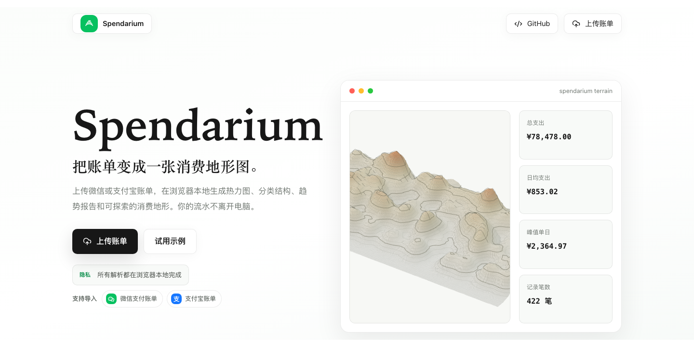

<div align="center">

# Spendarium

**Local-first Spending Atlas for WeChat Pay, Alipay, and CSV bills**

[Live Demo](https://chang-xinhai.github.io/Spendarium/) · [Repository](https://github.com/chang-xinhai/Spendarium)

---

<p align="center">
  
</p>

<p align="center">
  
  
  
  
  
  
</p>

> 🔐 **PRIVACY**: Spendarium parses and analyzes bills inside your browser. Your payment records are not uploaded to a server, and the public repo contains no real bill data.

</div>

---

<h2 align="center">✨ Features</h2>

<div align="center">

| Feature | Description |
|---------|-------------|
| 💳 **WeChat Pay / Alipay Import** | Parse exported payment bills from WeChat Pay and Alipay, with fallback support for generic CSV files |
| 🧭 **Spending Terrain** | Turn time, category, and amount into a readable Three.js financial landscape |
| 🟩 **GitHub-style Heatmap** | Show the latest 365 days by default, with year-level views for cross-year bills |
| 🏷️ **Topic Tags** | Create, delete, and assign multiple tags to transactions for hobbies, trips, projects, or life events |
| 📊 **Report Workspace** | Review summary cards, category breakdowns, top merchants, monthly cashflow, daily spending, and transaction details |
| 🕶️ **Privacy Mask** | Hide merchant names before exporting or sharing a report |
| 📤 **PNG / HTML Export** | Export the current report as an image or a standalone HTML file, including tag context |

</div>

---

<h2 align="center">🚀 Quick Start</h2>

### Online

<div align="center">

Open the hosted site and upload exported bills from WeChat Pay, Alipay, or a compatible CSV file.

**https://chang-xinhai.github.io/Spendarium/**

You can also click **试用示例** to explore with demo data.

</div>

### Local Development

```bash
git clone https://github.com/chang-xinhai/Spendarium.git
cd Spendarium
npm install
npm run dev
```

Build the static site:

```bash
npm run build
```

Preview the production build:

```bash
npm run preview
```

---

<h2 align="center">💳 Supported Bills</h2>

<div align="center">

| Source | Status | Notes |
|--------|--------|-------|
| WeChat Pay | ✅ Supported | Detects `微信支付账单` exports or files with `微信` in the filename |
| Alipay | ✅ Supported | Detects `支付宝` / `交易分类` exports or files with `支付宝` in the filename |
| Generic CSV | ✅ Supported | Requires columns such as date/time and amount; optional merchant/category/direction fields improve the report |

Spendarium can import multiple files at once. Transactions are merged and sorted locally before analysis.

</div>

---

<h2 align="center">⚙️ How It Works</h2>

<div align="center">

```txt
Payment CSV files ──browser File API──▶ local parser ──category rules──▶ finance model
      │                                                                     │
      └─────────────────────────────────────────────────────────────────────┤
                                                                            ├── Spending terrain
                                                                            ├── Heatmap
                                                                            ├── Category and merchant analysis
                                                                            ├── Monthly / daily trends
                                                                            ├── Topic tag views
                                                                            └── PNG / HTML export
```

The app is designed as a static website. It can run on GitHub Pages because all meaningful work happens in the browser.

</div>

---

<h2 align="center">🔐 Privacy Model</h2>

<div align="center">

| Rule | Detail |
|------|--------|
| Local parsing | Files are read with the browser File API |
| No backend upload | Bill data is not sent to a server |
| No account required | No login, hosted database, or remote workspace |
| Local tags | Topic tags are stored in browser `localStorage` |
| Local exports | PNG and HTML reports are generated from the current browser view |
| Repo hygiene | Do not commit real payment CSV files or screenshots containing private transactions |

</div>

---

<h2 align="center">🧱 Tech Stack</h2>

<div align="center">

| Layer | Tooling |
|-------|---------|
| Framework | Astro |
| UI | React |
| 3D | Three.js, `@react-three/fiber`, `@react-three/drei` |
| Export | `html-to-image`, standalone HTML generation |
| Deployment | GitHub Pages + GitHub Actions |

</div>

---

<h2 align="center">📁 Project Structure</h2>

```txt
src/
├── components/
│   ├── SpendariumApp.tsx    # Main app composition
│   └── TerrainMap.tsx       # Three.js spending terrain
├── lib/
│   ├── parser.ts            # WeChat Pay / Alipay / CSV parsing
│   ├── finance.ts           # Finance model and summaries
│   ├── categories.ts        # Category rules
│   ├── exportReport.ts      # Standalone HTML export
│   └── sampleData.ts        # Deterministic demo data
├── pages/
│   └── index.astro
└── styles/
    └── global.css
```

---

<h2 align="center">❓ FAQ</h2>

<details>
<summary><strong>Q: Does Spendarium upload my bill data?</strong></summary>

A: No. The current version parses files locally in the browser and does not use a backend.
</details>

<details>
<summary><strong>Q: Can I use bills across multiple years?</strong></summary>

A: Yes. The heatmap shows the latest 365 days by default and lets you switch to individual years.
</details>

<details>
<summary><strong>Q: Can one transaction have multiple tags?</strong></summary>

A: Yes. A transaction can belong to multiple topic tags, such as `旅行`, `学习`, or a custom hobby/project tag.
</details>

<details>
<summary><strong>Q: Can I share a report without exposing merchant names?</strong></summary>

A: Yes. Enable the merchant privacy mask before exporting PNG or HTML.
</details>

<details>
<summary><strong>Q: Is this a full accounting app?</strong></summary>

A: No. Spendarium is closer to a private spending atlas: visual, inspectable, and lightweight, not a full bookkeeping system.
</details>

---

<h2 align="center">🚢 Deployment</h2>

<div align="center">

This repository is configured for GitHub Pages.

</div>

```txt
site: https://chang-xinhai.github.io
base: /Spendarium
```

<div align="center">

The GitHub Actions workflow builds Astro and publishes `dist/` to Pages.

Made by [chang-xinhai](https://github.com/chang-xinhai).

</div>
